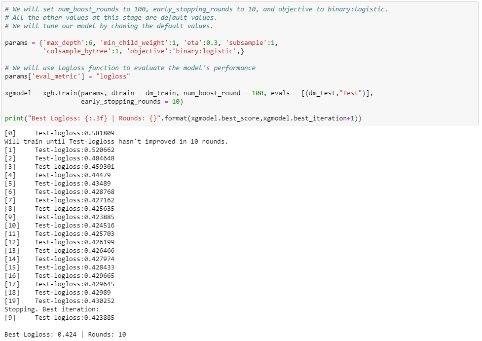
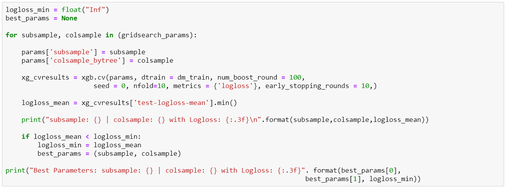
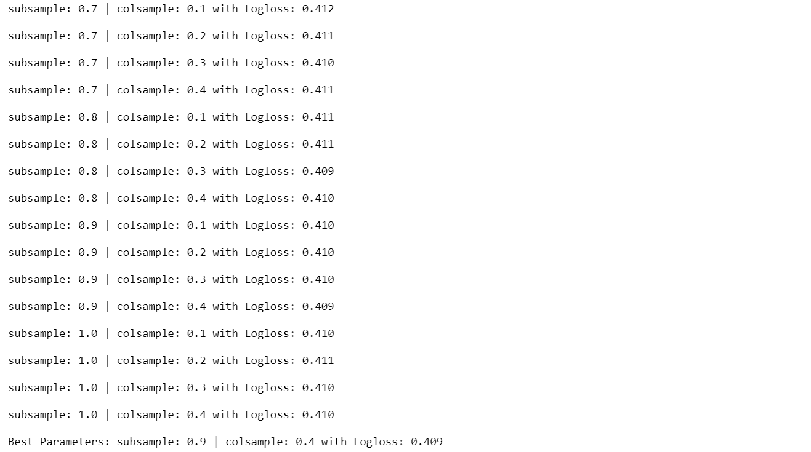
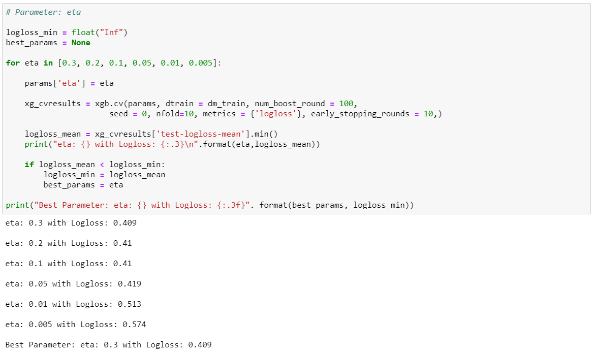

# XGBoost Hyperparamter Tuning - Churn Prediction

## A. Goal
XGBoost is an effective machine learning algorithm; it outperforms many other algorithms in terms of both speed and efficiency. The implementation of XGBoost requires inputs for a number of different parameters. To completely harness the model, we need to tune its parameters. We will list some of the important parameters and tune our model by finding their optimal values. 

*Note*: I have used an Amazon EC2 instance (t2.micro on Ubuntu) for running Jupyter. This is a free tier instance, and I used Powershell to SSH to it.

## B. Dataset
The focus of the dataset is on customer attrition within the telecommunication industry. The data is of a telecom service provider. Such type of data is often used by organizations to build prediction models, and companies use the models to identify customers who can discontinue services. Following are the variables in the dataset.

*Target Variable*  
- Churn - Customers who discontinued services within last month

*Input Variables*  
- Demographic Information - age, gender, partner, and dependents  
- Service Details - phone, multiple lines, internet, online backup, online security, tech support, device protection, and streaming  
- Account Information - subscription tenure, contract, monthly charges, total charges, paperless billing, payment method  

Data Source: https://www.kaggle.com/blastchar/telco-customer-churn

## C. Preprocessing
- Cleaning - removal of the null values, assigning appropriate data types to variables  
- Encoding categorical variables using one hot encoding  
- Splitting the dataset into test and train and converting these dataframes into data matrices  

For more information on data cleaning and visualization, please go through my [previous analysis](https://github.com/Nickssingh/Churn-Prediction-Model-Telecommunication) on the same dataset.  

## D. Building Model

We will use the following steps in the process  
1.	Convert the train and test dataframes into data matrix format – as XGBoost uses DMatrix
2.	Find the logloss of the model with default parameters
3.	Tune the parameters
4.	Find the logloss of the model with tuned parameters  

Ideal case would include an exhaustive gridsearch will all the paramaters, but such an approach is computationally expensive; hence, we will focus on a few important parameters and tune them sequentially. We will tune the following parameters in the process.  
-	*num_boost_rounds*: It specifies number of boosting trees while training
-	*early_stopping_rounds*: This parameter evaluates performance of model for a specified number of rounds, and if the performance does not improve during those many rounds, the training process is stopped.
-	*max_depth*: Depth of a tree is distance between the root and the leaf furthest from the root. Model becomes more complex and tends to overfit as this value increases. Also, memory consumption increases with increase in tree depth.
-	*min_child_weight*: This is used to control the partitioning of tree as it impacts splits within the tree. If a node has sum of instance weight less the minimum specified, then the process will not partition that node. 
-	*Subsample*: It is the proportion of the data randomly sampled by XGBoost. 
-	*colsample_bytree*: It is the ratio of the number of columns used in tree construction. 
-	*eta*: It is the learning rate. Higher values make boosting process conservative by shrinking the weights of the features and prevents overfitting.

More information on the above mentioned and other parameters can be found [here](https://xgboost.readthedocs.io/en/latest/parameter.html).  

1. Converting dataframes into data matrix   

DMatrix – XGBoost uses data matrix to improve speed and memory efficiency. Hence we have converted the dataframes into data matrices. 

More info on data matrix can be found [here](https://xgboost.readthedocs.io/en/latest/python/python_api.html).  

2. Building model with default parameters and finding its logloss value  

  

We have used the default values for parameters and our eval_metric is logloss function. Here we had num_boost_rounds = 100 and early_stopping_rounds = 10; these values could be much larger – producing better results but at the expense of high resource consumption.  

Finding a suitable evidence to stop iterations is important; it prevents both overfitting and inefficienct utilization of resources. Here we found that the tenth round gave the best result; the results after that round did not improve – hence the iteration stopped within 10 rounds after the best result.  

The logloss value is 0.424. We will tune the parameters to decrease logloss.  

3. Tuning the parameters  

a. *Parameters*: max_depth and min_child weight  

  
  

We have used cross validation to tune the parameters within the params dictionary. Through multiple iterations, I realized that the optimum values for max_depth and min_child_weight lies in the specified range.  

  

We updated the two parameters with the values producing the lowest logloss.  
max_depth = 2 and min_child_weight = 19  

b. *Parameters*: subsample and colsample  

  
  
  
  

Here we followed the process we used for the first two parameters and updated the parameters.  
Subsample = 0.9 and colsample = 0.4  

c. *Parameter*: eta

  
  

We used the same process to update eta value.  
eta = 0.3  

4.	Building model with tuned parameters and finding its logloss value  

  

We defined a new parameter dictionary with optimum values.  

  
  

Finally, we developed a new model with new parameter values. Calculated its logloss and the number of rounds required to reach the lowest logloss value.  

We needed 27 iterations to achieve the best result and the improvement was marginal; the logloss value of the model with default values was 0.424 and after tuning, we achieved 0.417. Though the improvement was small, we were able to understand hyperparameter tuning process.  

we have used only a few combination of parameters. We could have further improved the impact of tuning; however, doing so would be computationally more expensive. More combination of parameters and wider ranges of values for each of those paramaters would have to be tested.   
